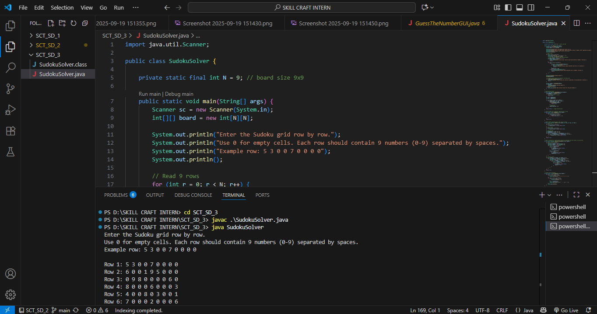
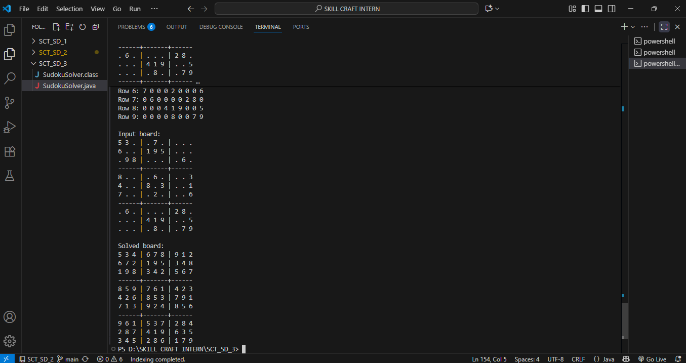

# 🎯 SudokuSolver – Automatic Sudoku Puzzle Solver (Console)

This project is **Task 03** for the **SkillCraft Technology Software Development Internship (Software Development Track)**.  
It’s a Java-based console application that automatically solves **9×9 Sudoku puzzles** using the **Backtracking Algorithm**.

---

## 📝 Project Overview

SudokuSolver allows users to input a Sudoku puzzle row by row (`0` represents empty cells).  
The program solves the puzzle automatically and displays the solved board in a **clean, professional grid format**.

- **Input:** 9×9 Sudoku grid (console input)  
- **Output:** Solved Sudoku displayed in grid format  
- **Algorithm:** Backtracking (recursive approach)  

---

## ✨ Features

- 🕹 **Automatic Sudoku Solving** – solves any valid 9×9 Sudoku puzzle  
- 🎛 **Console Input** – row-wise input with 0 for empty cells  
- ✅ **Input Validation** – ensures only numbers 0–9 and no duplicates in initial puzzle  
- ⚡ **Clean Grid Output** – shows both input and solved boards clearly  
- 🚀 **Instant Feedback** – solved puzzle displayed immediately  

---

## 🖥️ Screenshots

### Input Board


### Solved Board



---

## 🚀 How to Run

### 1️⃣ Compile the Program
```bash
javac SudokuSolver.java
java SudokuSolver
```

---

## 📂 Project Structure

SCT_SD_3/

│-- SudokuSolver.java          # Main console solver

│-- Result/               # Screenshots of input/output

│    │-- Console.png

│    │-- ConsoleOutput.png

│-- README.md                  # Project documentation

---

## 🌱 Skills Practiced

✅ Java programming fundamentals (2D arrays, loops, recursion)

✅ Backtracking algorithm implementation

✅ Input validation & error handling

✅ Designing user-driven console applications

✅ Console output formatting (professional grid style)

✅ Git & GitHub version control

